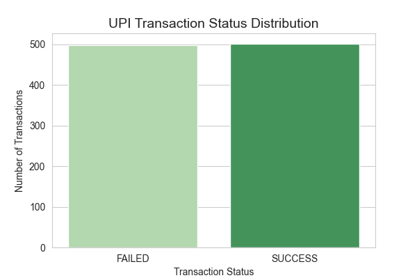
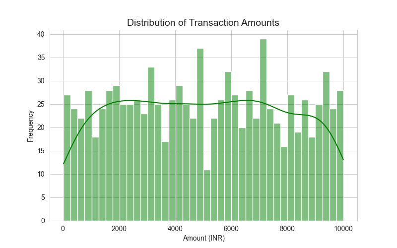
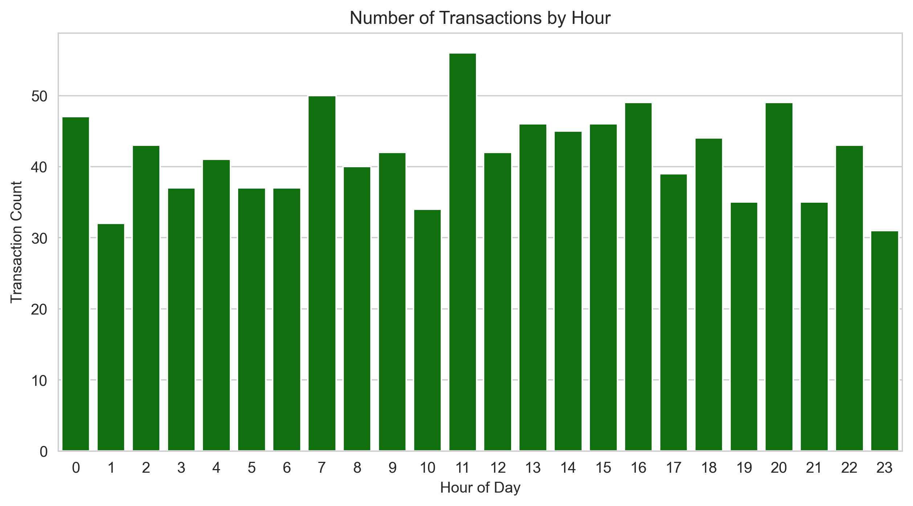
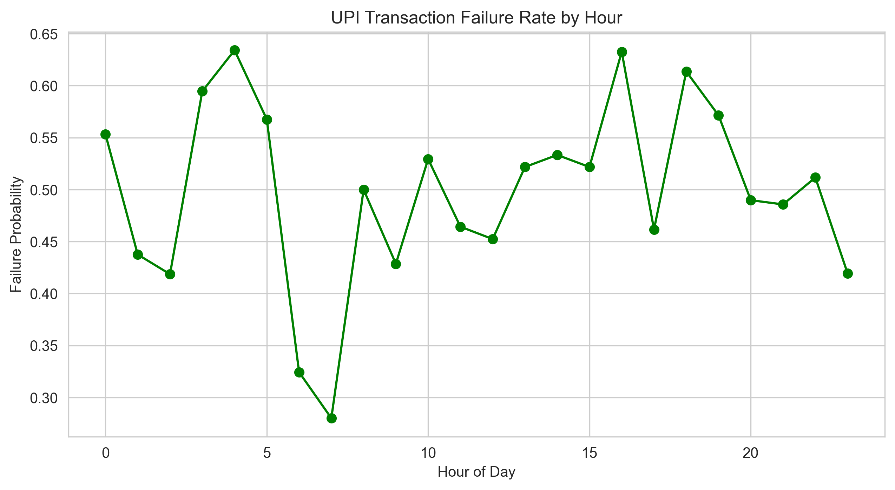
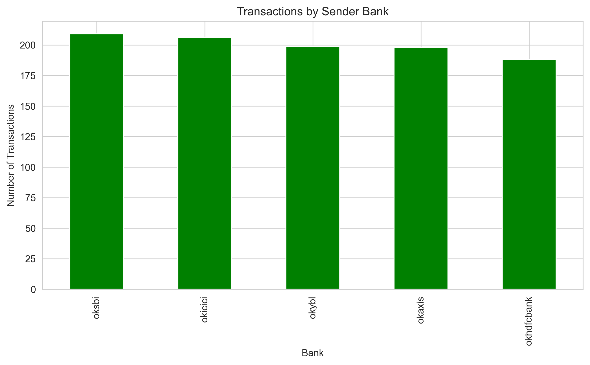
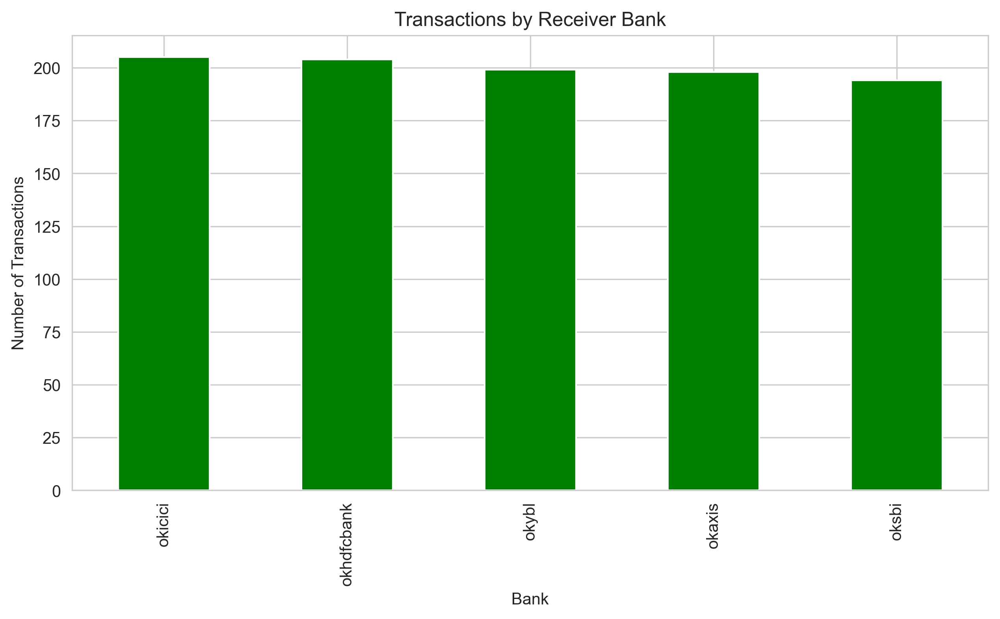
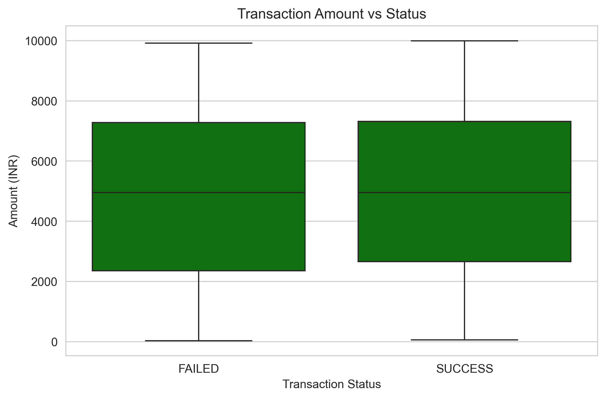
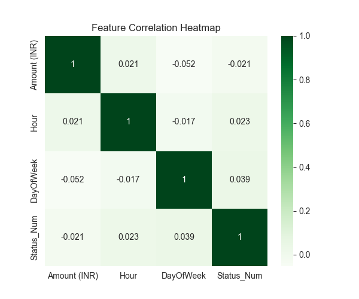

# 💳📊 UPI Transaction Failure Prediction using Machine Learning 🚀


<div align="center">
  
  
  
  
</div>

<br>

This repository presents an **academic machine learning study** that analyzes synthetic UPI transaction data and builds predictive models to estimate the probability of transaction failures.

The project explores how **transaction metadata such as amount, time of day, and bank identifiers** can influence the likelihood of payment failures.

The goal is to demonstrate how **predictive analytics can improve payment reliability in digital payment ecosystems**.

---

# 📌 Project Overview

Digital payment systems like **UPI (Unified Payments Interface)** process millions of transactions every day.  
While most transactions succeed, some fail due to factors such as:

- ⏱ Peak transaction load  
- 🏦 Bank server response delays  
- 💰 High transaction amounts  
- 🌐 Network congestion  
- 🔄 Bank‑to‑bank routing issues  

This project investigates whether **machine learning models can learn patterns in transaction data to predict failures before execution**.

The work is purely **research and educational**, using **synthetic data**.

---

# 📂 Repository Structure

```
upi-failure-prediction
│
├── data
│   └── transactions.csv
│
├── plots
│   ├── amount_distribution.png
│   ├── amount_vs_status.png
│   ├── correlation_heatmap.png
│   ├── failure_rate_hour.png
│   ├── receiver_bank_distribution.png
│   ├── sender_bank_distribution.png
│   ├── status_distribution.png
│   └── transactions_by_hour.png
│
├── src
│   ├── eda_plots.ipynb
│   └── model_training.ipynb
│
├── README.md
└── requirements.txt
```

---

# 📊 Notebooks

### 📈 Exploratory Data Analysis

Click to open the notebook:

➡️ **[Open EDA Notebook](src/eda_plots.ipynb)**

This notebook performs:

- Data exploration  
- Transaction pattern analysis  
- Feature understanding  
- Visualization of payment behavior  

---

### 🤖 Machine Learning Model

Click to open the notebook:

➡️ **[Open Model Training Notebook](src/model_training.ipynb)**

This notebook includes:

- Feature engineering  
- Data preprocessing  
- Train/Test split  
- Random Forest model  
- XGBoost model  
- Transaction failure prediction  

---

# 📂 Dataset

The dataset used in this project is stored in the repository.

➡️ **[Open Dataset](data/transactions.csv)**

Original dataset source:

https://www.kaggle.com/datasets/devildyno/upi-payment-transactions-dataset

---

# ⚖️ Ethics & Data Disclaimer

This project uses a **synthetic dataset** designed for machine learning experimentation.

✔ No real financial data is used  
✔ No real bank or user data is included  
✔ Used strictly for **academic research purposes**

This project **is not affiliated with NPCI or any financial institution**.

---

# 📈 Generated Visualizations

All plots generated during exploratory analysis are stored in the **plots folder**.

➡️ **[Open Plots Folder](plots)**

---

### 📊 Transaction Status Distribution



---

### 💰 Transaction Amount Distribution



---

### ⏰ Transactions by Hour



---

### ⚠️ Failure Rate by Hour



---

### 🏦 Sender Bank Distribution



---

### 🏦 Receiver Bank Distribution



---

### 💳 Transaction Amount vs Status



---

### 🔗 Feature Correlation Heatmap



---

# ⚙️ Installation

Clone the repository:

```bash
git clone https://github.com/yourusername/upi-failure-prediction.git
```

Install dependencies:

```bash
pip install -r requirements.txt
```

➡️ **[View Requirements File](requirements.txt)**

---

# 🚀 Running the Project

Open the notebooks in **Jupyter Notebook or VS Code**.

Run exploratory analysis:

```
src/eda_plots.ipynb
```

Run model training:

```
src/model_training.ipynb
```

---

# 🎯 Research Objective

This project demonstrates how machine learning can be used to analyze digital payment transactions and predict the probability of transaction failures using transaction metadata such as:

- Transaction amount  
- Time of transaction  
- Sender bank  
- Receiver bank  

The goal is to explore how predictive analytics could help improve **digital payment reliability**.

---

# 🛠 Technologies Used

- 🐍 Python
- 📊 Pandas
- 🔢 NumPy
- 📉 Matplotlib
- 📈 Seaborn
- 🤖 Scikit-learn
- ⚡ XGBoost
- 📓 Jupyter Notebook

# 
<div>
  
  <h3 align="left">Maintained By - Priyam Aggarwal (https://github.com/priyamaggarwal18)</h3>
    <a href="https://itspriyam.vercel.app" target="_blank" style="text-decoration: none;">
    
  </a>&nbsp&nbsp;
  <a href="https://www.linkedin.com/in/priyamaggarwal" target="_blank" style="text-decoration: none;">
  
</a>&nbsp&nbsp;
</div>
